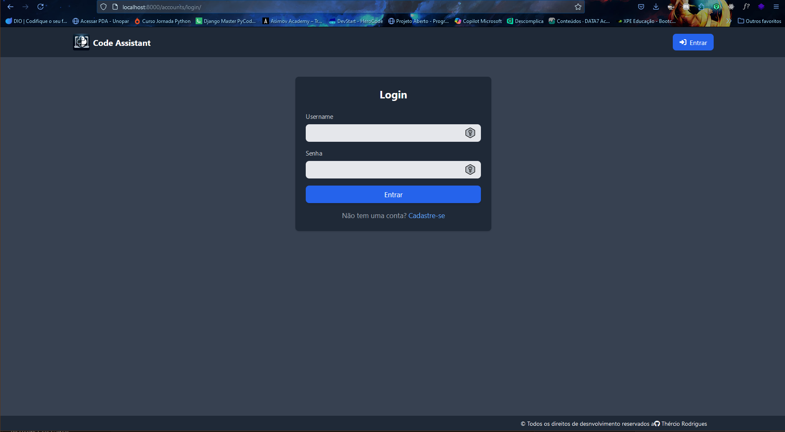
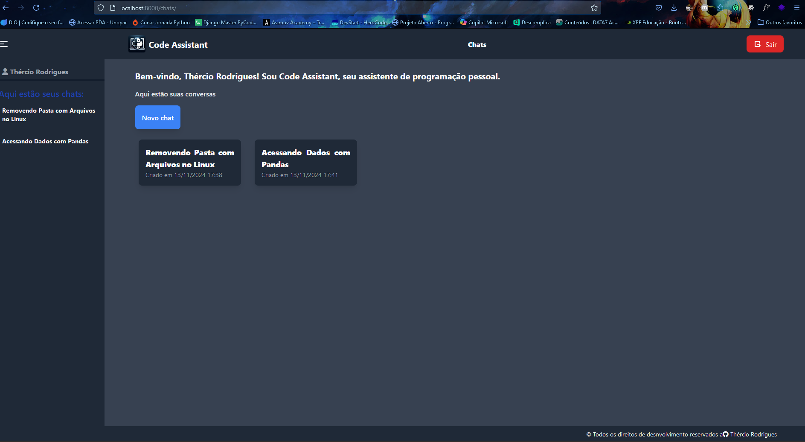
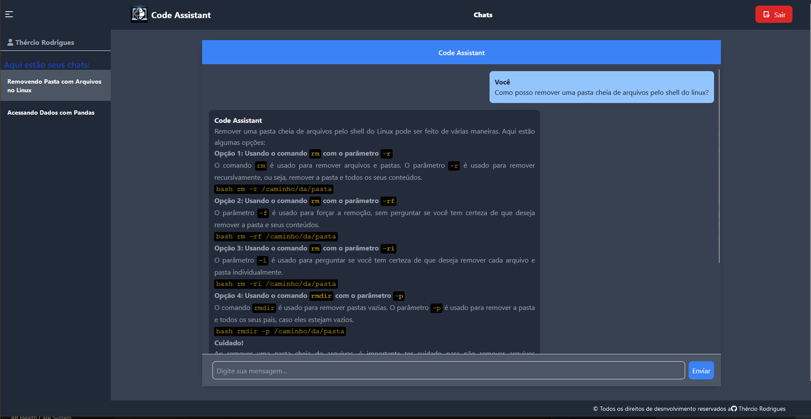

# 🚀 Code Assistant

## 📒 Sobre

Esta aplicação se trata de um agent de IA que exerce função de assistente de código, fornecendo informações, dicas e tirando dúvidas sobre as tecnologias e linguagens que lhe é passada.

## 💡Versão e Funcionalidades

Atualmente a aplicação encontra-se na versão 1.0, e oferece com recursos:

* Cadastro de usuário.
* Chats de conversa com o IA.
* Agrupamento das conversas dos chats, podendo você dividir os chats por assuntos ou outra particularidade.
* Cada usuário só tem acesso ao seus grupos e chats de conversas. Acesso somente por login de user cadastrado.
* Formulário para alteração de senha de usuário e alteração de dados do usuário.
* Formulário para reset de senha, caso o usuário tenha esquecido, com envio automático de e-mail com link de código de uso único e tempo de expiração de uso.
* Integração com sistema de webhook para envio de e-mails e notificações em caso de ocorrência de eventos específicos.

## 🧱 Stack utilizada

Front-end: HTML, CSS com Tailwind e JavaScript.

Back-end: Python, Docker, GROQ para IA

## 🛠 Instalação

Estão disponíveis duas formas para rodar a aplicação localmente em sua máquina. Antes de rodar, é necessário baixar a aplicação pelo comando abaixo:

```bash
git clone https://github.com/thercior/code-assistent.git
```

###### Ambiente virtual

1. No terminal dentro da pasta do projeto clonado, execute o comando abaixo para criar e ativar o ambiente virtual:

   ```shell
   # Criar e ativar para windows
   python -m venv venv
   venv\Scripts\activate

   # Criar e Ativar para Linux
   python3 -m venv venv
   source venv/bin/activate
   ```
2. Em seguida, instale as dependências do projeto conforme a seguir.

   ```shell
   pip install -r requirements.txt
   ```
3. Crie o arquivo .env dentro da pasta config, para colocar as variáveis de ambiente, conforme a seguir:

   ```
   SECRET_KEY='cole chave sua Secret Key' 
   DB_NAME='nome do seu banco'
   DB_USER='nome de usuário do banco'
   DB_PASSWORD='[assword do banco'
   DB_HOST='host do banco' # se localmente, será o localhost
   DB_PORT=sua_porta # se for o postgres, a porta geralmenta 5432
   DEBUG_DEV=True # para rodar localmente True, e criará banco sqlite. Caso rode em produção, coloque False e o banco será o que você configurará aqui
   DEBUG_PRODUCTION=False
   GROQ_API_KEY=sua api groq - crie uma no site da groq.
   ```

   *Obs: caso não tenha a SECRET_KEY, crie um projeto django do zero e copie e cole a chave dele aqui.*
4. Rode as migrações conforme a seguir

   ```shell
   python manage.py makemigrations
   python manage.py migrate
   ```
5. Crie um super usuário.

   ```shell
   python manage.py createsuperuser
   ```

   Informe um nome de usuário, seu e-mail e a senha.
6. Rode aplicação com o comando abaixo e ela estará disponível em `localhost:8000/chats/`

###### Container Docker

1. Tendo o docker e o docker-compose instalado, no diretório do projeto, rode o seguinte comando para criar a imagem do app:

   ```
   docker-compose build
   ```
2. Com a imagem do app criada, para subir o container, basta executar:

   ```
   docker-compose up -d
   ```
3. A aplicação vai estar disponível em `localhost:8051/chats`. Para parar o container , basta executar `docker-compose down`

## 📊 Screenshots







## 📝 Licença

Code Assistent está sobre uma [🔗 Licença MIT](https://github.com/thercior/code-assistent/blob/main/LICENSE)
